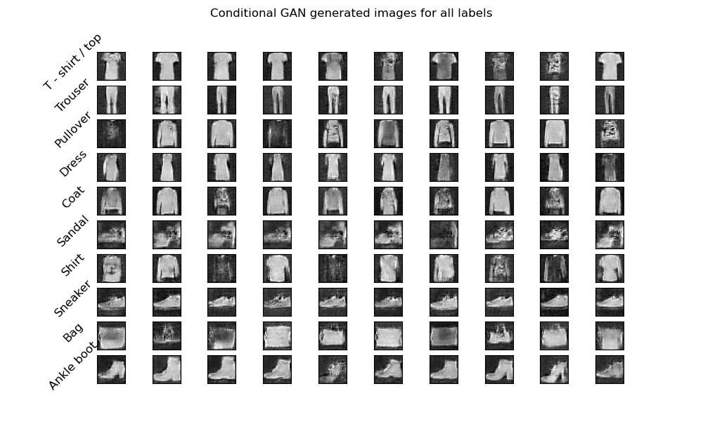
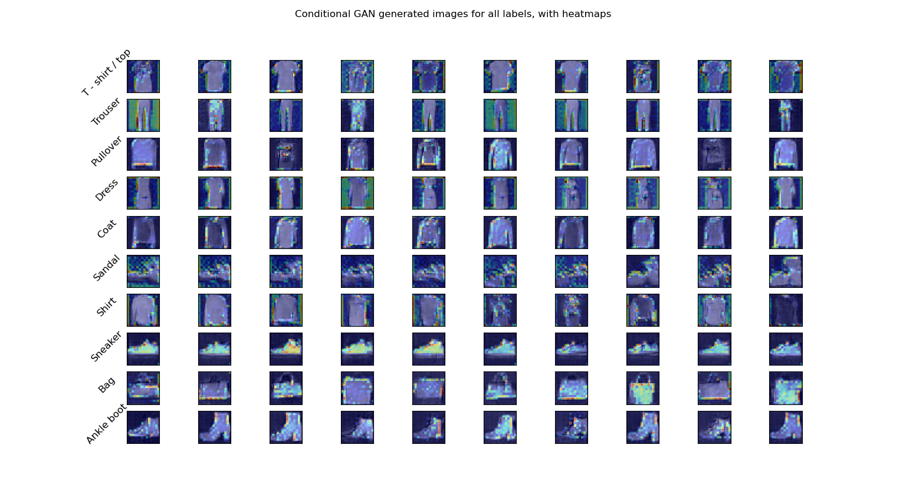

# Conditional GAN - Fashion MNIST



A toy Conditional GAN trained on the Fashion-MNIST dataset for the [Deep Learning Computer Vision](https://perso.ensta-paris.fr/~franchi/Cours/IA323.html) course at ENSTA.
Inspiration was taken from the [DCGan PyTorch example](https://pytorch.org/tutorials/beginner/dcgan_faces_tutorial.html), and adapted for conditional GANs.

The dependencies needed can be found in [`requirements.txt`](./requirements.txt).

In order to train and showcase the model, run the following command:

```bash
python main.py
```

## Techniques used

- Because the GAN generates images with `float32` values ranging from -1 to 1, we convert the dataset images from `uint8` (0, 255) to this interval as well.
- In order to avoid the discriminator outperforming the generator, for each batch, we only backpropagate and train the discriminator if it cannot recognize more than 90% of the fake images as fake. This prevents the generator from outputting random noise during training because the discriminator already has a 100% detection rate.

## Project Overview

```
├── display.py        # Display utilities
├── fashion_mnist.py  # Dataset
├── main.py           # Entrypoint: train & showcase
├── networks.py       # Generator & Discriminator models
├── train_cgan.py     # Training function
└── utils.py          # Utilities
```

## GradCAM Analysis

Using a GAN gives us the opportunity to study how the discriminator decides whether an image is real or fake for the Fashion-MNIST dataset.
We can view it through activation heatmaps of the discriminator on fake images using [GradCAM](https://arxiv.org/pdf/1610.02391).



We can see that for some classes like "Sneaker", the discriminator focuses on details inside the object to determine whether the image was generated by the generator. For classes like "Coat", "Pullover" or "Shirt", it looks at the borders of the object. For classes like "Bag", it sometimes looks at the border, and sometimes at the content. However, keep in mind that this is not an indication on how to identify the class of an image from the Fashion-MNIST dataset, but rather an indication of the areas that the generator model fails the most at replicating.
